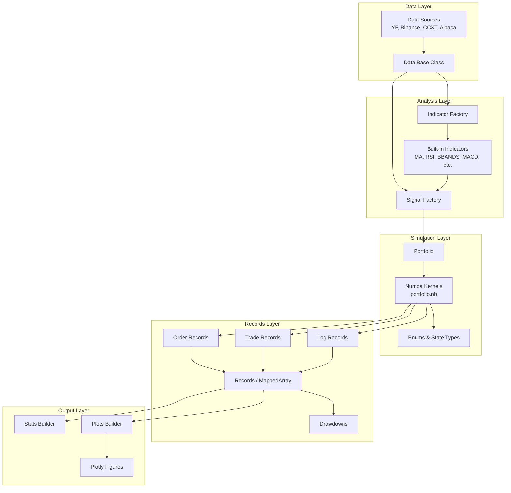

# vectorbt

> Vectorized backtesting and quantitative analytics framework built on NumPy, Pandas, and Numba.

**Version**: 0.28.1
**Author**: Oleg Polakow
**License**: Apache 2.0 with Commons Clause
**Python**: >= 3.13

## Overview

vectorbt is a Python library for backtesting and analyzing trading strategies at scale. It leverages NumPy and Pandas for vectorized computations and Numba for JIT-compiled simulation kernels, enabling users to evaluate thousands of parameter combinations in seconds rather than hours. Unlike event-driven frameworks that iterate tick-by-tick, vectorbt operates on entire arrays simultaneously, making it orders of magnitude faster for parameter sweeps and portfolio analysis.

The library provides three simulation modes (`from_orders`, `from_signals`, `from_order_func`), a flexible indicator factory for building custom technical indicators, a sparse records system for memory-efficient event storage, and integrated plotting via Plotly.

## Official Links

| Resource | URL |
|----------|-----|
| GitHub | https://github.com/polakowo/vectorbt |
| Documentation | https://vectorbt.dev |
| Bug Tracker | https://github.com/polakowo/vectorbt/issues |

## Quick Start

Run an MA crossover backtest with inline data -- no external files or API keys required:

```python
import numpy as np
import pandas as pd
import vectorbt as vbt

# Generate synthetic price series
np.random.seed(42)
dates = pd.date_range("2020-01-01", periods=500, freq="B")
close = pd.Series(
    100 * np.cumprod(1 + np.random.randn(500) * 0.01),
    index=dates, name="Price"
)

# Compute fast and slow moving averages
fast_ma = close.rolling(10).mean()
slow_ma = close.rolling(30).mean()

# Generate entry/exit signals from MA crossover
entries = (fast_ma > slow_ma) & (fast_ma.shift(1) <= slow_ma.shift(1))
exits = (fast_ma < slow_ma) & (fast_ma.shift(1) >= slow_ma.shift(1))

# Simulate portfolio
pf = vbt.Portfolio.from_signals(
    close, entries=entries, exits=exits,
    init_cash=10_000, fees=0.001, freq="1D"
)
print(pf.stats())
```

## Architecture Summary

vectorbt follows a layered architecture where raw data flows through indicators and signal generators into a portfolio simulator. The simulator produces sparse records (orders, trades, logs) that are analyzed through a metrics and statistics layer, with results visualized via Plotly.



## Core Components

| Component | Module | Description |
|-----------|--------|-------------|
| **Portfolio** | `portfolio.base` | Core simulation engine with `from_orders`, `from_signals`, `from_order_func` modes |
| **Numba Kernels** | `portfolio.nb` | JIT-compiled order processing, buy/sell execution, simulation loops |
| **Indicator Factory** | `indicators.factory` | Meta-programming factory for creating vectorized indicator classes |
| **Signal Factory** | `signals.factory` | Extends IndicatorFactory for entry/exit signal generation |
| **Records** | `records.base` | Sparse event storage (orders, trades, positions, drawdowns) |
| **MappedArray** | `records.mapped_array` | Column-mapped arrays for efficient record querying |
| **Data** | `data.base` | Base data fetching with symbol dictionary support |
| **Data Sources** | `data.custom` | YFData, BinanceData, CCXTData, AlpacaData, SyntheticData, GBMData |
| **ArrayWrapper** | `base.array_wrapper` | Pandas-aware wrapper preserving index/column metadata |
| **Settings** | `_settings` | Global hierarchical configuration system |
| **Generic** | `generic` | Drawdowns, ranges, splitters, stats/plots builders |
| **Returns** | `returns` | Return-based metrics and analysis |
| **Labels** | `labels` | Labeling utilities for ML-based strategies |
| **Messaging** | `messaging` | Telegram bot integration for alerts |
| **Utils** | `utils` | Config, caching, decorators, datetime, math, templates |

## Built-in Indicators

MA, MSTD, BBANDS, RSI, STOCH, MACD, ATR, OBV -- plus adapters for TA-Lib, pandas-ta, and the `ta` library via `IndicatorFactory.from_talib()`, `.from_pandas_ta()`, `.from_ta()`.

## Built-in Signal Generators

RAND, RANDX, RANDNX, RPROB, RPROBX, RPROBCX, RPROBNX, STX, STCX, OHLCSTX, OHLCSTCX -- random and stop-loss/take-profit signal generators.

## Related Documentation

- [Architecture](architecture.md) -- System design, class hierarchy, vectorized computation approach
- [Workflow](workflow.md) -- Backtesting pipeline, signal generation, portfolio simulation flows
- [State Management](state-management.md) -- Portfolio state tracking, records, caching
- [Development](development.md) -- Setup, custom indicators, custom signals, performance tips
