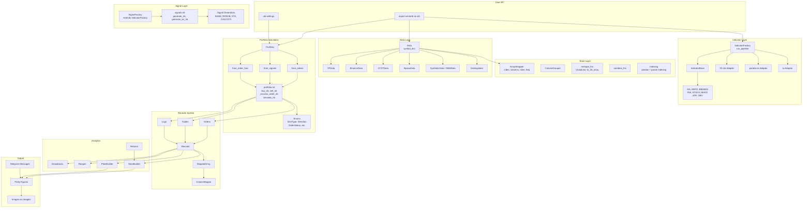
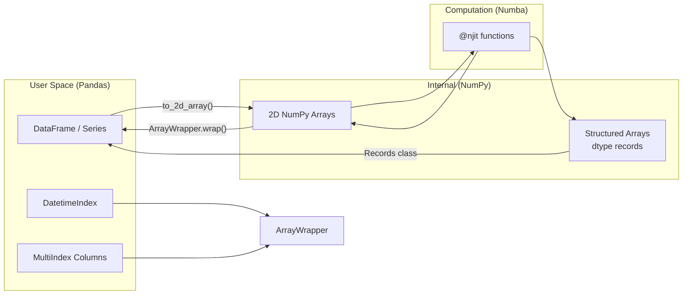
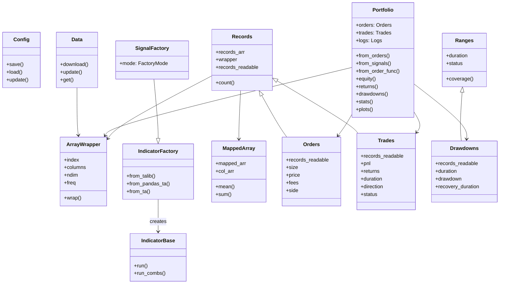

# vectorbt -- Architecture

## System Architecture

## Trading Paradigm & Key Features

| Feature | Support | Details |
|---------|---------|---------|
| Backtesting Approach | Vector-based | Pandas/NumPy arrays with Numba JIT-compiled simulation kernels; entire parameter grids run in a single call |
| Live Trading | No | Backtesting and analysis only; no broker connectivity |
| Paper Trading | No | No built-in paper trading mode |
| Multi-Asset | Yes | Native multi-column support via broadcasting; portfolio simulation across multiple assets simultaneously |
| Data Feeds | Yahoo Finance, Binance, CCXT, Alpaca, synthetic | `Data` base class with `YFData`, `BinanceData`, `CCXTData`, `AlpacaData`, `GBMData`; `DataUpdater` for scheduled refresh |
| ML Integration | No | No built-in ML; `labels` module provides ML labeling utilities; custom Numba callbacks can wrap models |
| Risk Management | Built-in | Stop-loss, take-profit, trailing stops in `from_signals`; position sizing via `SizeType` enum |
| Optimization | Yes | Vectorized parameter sweeps via broadcasting (no Python loop); all combinations run in one simulation call |
| Execution | Simulated | Numba-compiled order processing (`buy_nb`, `sell_nb`, `process_order_nb`) with fees, slippage, and size granularity |

## Core Components

### Portfolio (`portfolio.base.Portfolio`)

The central class of vectorbt. It models a portfolio as a series of positions allocated against a cash component, producing an equity curve with transaction costs.

**Three simulation modes:**

1. **`from_orders`** -- Most direct and fastest. Takes size, price, fees as arrays; broadcasts them; creates orders per element. Best when order logic is predetermined.

2. **`from_signals`** -- Signal-driven abstraction over `from_orders`. Accepts boolean entry/exit arrays. Handles position management (prevents duplicate entries), stop-loss, take-profit. With `accumulate=True` behaves like `from_orders`.

3. **`from_order_func`** -- Most flexible. Accepts a Numba-compiled callback function invoked at each time step with full context (current state, prices, etc.). Enables stateful strategies.

### Indicator Factory (`indicators.factory.IndicatorFactory`)

A meta-programming factory that generates indicator classes dynamically. Each generated class:

- Accepts input arrays of any compatible shape via broadcasting
- Supports arbitrary parameter grids (window sizes, periods, etc.)
- Caches intermediate results
- Supports pandas and parameter indexing
- Generates helper methods for all inputs, outputs, and properties

The pipeline: inputs + parameters -> broadcast -> compute per parameter combo -> concatenate outputs.

### Signal Factory (`signals.factory.SignalFactory`)

Extends `IndicatorFactory` with entry/exit choice functions. Supports multiple generation modes defined in `signals.enums.FactoryMode`: entry-only, exit-only, or both.

### Records System (`records.base.Records`)

A memory-efficient alternative to dense matrices for sparse event data. Instead of NxM matrices with mostly NaN values, records store only the events that occurred, with each record containing an id, column index, row index, and arbitrary attributes.

**Key advantage:** Multiple records can map to a single matrix element (e.g., multiple orders at the same timestamp), which is impossible in matrix form.

`MappedArray` provides column-mapped views for efficient aggregation and querying.

### Numba Kernels (`portfolio.nb`)

JIT-compiled functions using `@njit(cache=True)` for:
- `buy_nb` / `sell_nb` -- Order execution with slippage, fees, size granularity
- `process_order_nb` -- Order validation, fill/reject logic
- `simulate_nb` variants -- Main simulation loops traversing (time x assets) arrays

All functions accept only NumPy arrays and Numba-compatible types. Functions passed as arguments must also be Numba-compiled.

### ArrayWrapper (`base.array_wrapper.ArrayWrapper`)

Wraps NumPy arrays with Pandas metadata (index, columns, ndim, freq). Enables vectorbt to operate on raw arrays internally while preserving DataFrame semantics for the user.

## Vectorized Computation Approach

vectorbt's core design principle is **array-first computation**:

1. **Broadcasting**: All inputs are broadcast to a common shape. A parameter like `window=[10, 20, 30]` expands the data into 3 columns automatically.

2. **Numba JIT**: Critical simulation loops are compiled to machine code via Numba's `@njit` decorator with `cache=True` for persistent compilation.

3. **No Python loops in hot paths**: The simulation traverses the shape element-by-element in compiled code, not Python.

4. **Lazy evaluation**: Many properties are computed on-demand and cached.

## NumPy/Pandas Integration

- User provides Pandas DataFrames/Series
- vectorbt strips metadata, stores it in `ArrayWrapper`
- Computation runs on raw NumPy arrays via Numba
- Results are wrapped back into Pandas objects

## Class Hierarchy

## Module Dependency Map

| Module | Depends On |
|--------|-----------|
| `portfolio` | `base`, `generic`, `records`, `returns`, `signals`, `utils` |
| `indicators` | `base`, `utils` |
| `signals` | `indicators`, `base`, `utils` |
| `records` | `base`, `utils` |
| `generic` | `base`, `records`, `utils` |
| `data` | `base`, `utils` |
| `returns` | `generic`, `base`, `utils` |
| `labels` | `generic`, `base`, `utils` |
| `base` | `utils` |

---
## See Also
- [README](README.md) — Project overview and quick start
- [Workflow](workflow.md) — Event flows and processing pipelines
- [State Management](state-management.md) — State lifecycle and data models
- [Development](development.md) — Development guide and best practices
