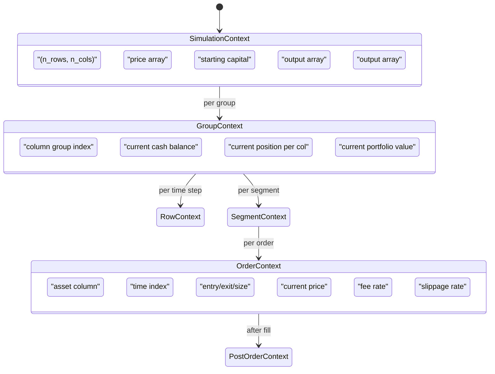
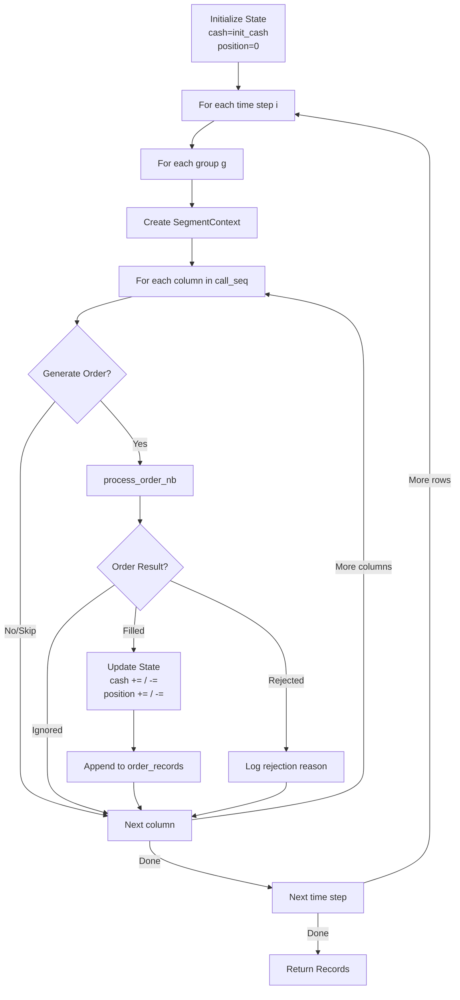
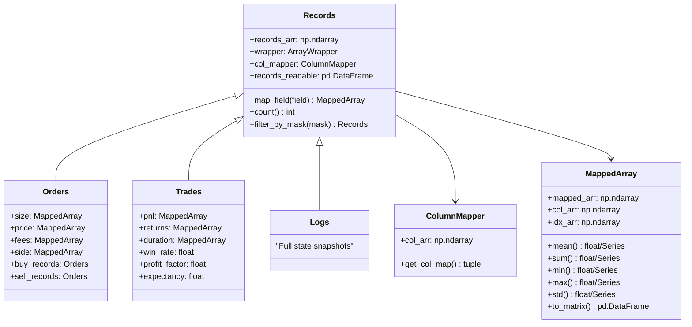
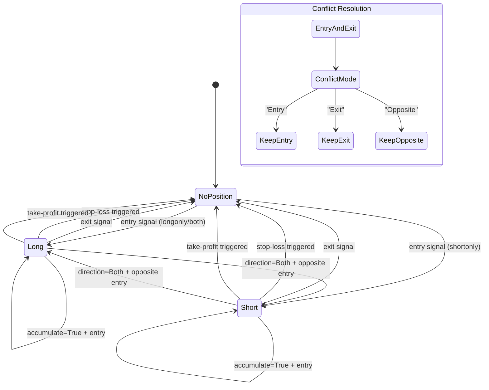
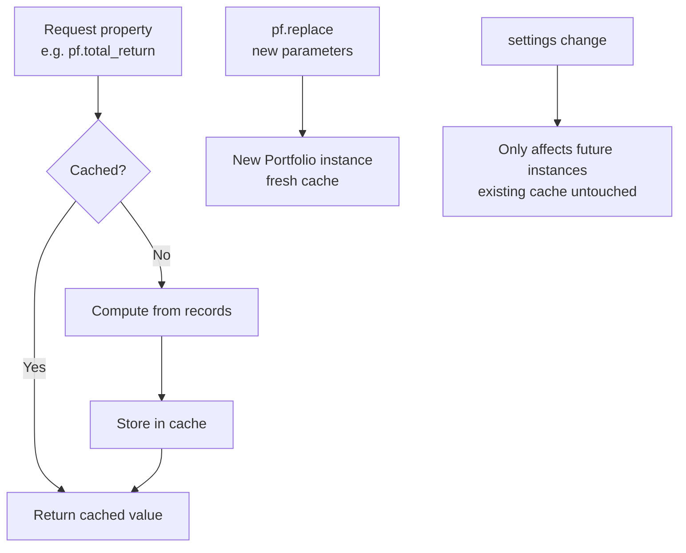

# vectorbt -- State Management

## Portfolio State Tracking

During simulation, vectorbt maintains state per asset column using Numba-compiled named tuples. State is updated in-place as the simulation traverses the time x assets matrix.

### Simulation State Hierarchy



### State Types (from `portfolio.enums`)

| Type | Fields | Purpose |
|------|--------|---------|
| `SimulationContext` | target_shape, close, init_cash, order_records, log_records | Top-level simulation context |
| `GroupContext` | group, group_len, cash_sharing, ... | Per-group state (for cash sharing) |
| `RowContext` | i (row index) | Current time step |
| `SegmentContext` | extends GroupContext with call_seq | Segment within a group |
| `OrderContext` | col, i, position_now, exec_state, signal info | Context for order decision |
| `PostOrderContext` | extends OrderContext with OrderResult | Context after order processing |
| `FlexOrderContext` | col, i, position_now, exec_state | Flexible order function context |
| `ExecuteOrderState` | cash, position, debt, locked_cash, free_cash | Execution state for buy/sell |
| `ProcessOrderState` | cash, position, debt, locked_cash, free_cash, val_price, value | Full process state |

### State Update Flow



## Order and Trade Records Management

### Record Data Types

Records are NumPy structured arrays with fixed schemas:

**Order Record (`order_dt`)**:
- `id`: Unique order identifier
- `col`: Column (asset) index
- `idx`: Row (time) index
- `size`: Executed size
- `price`: Execution price
- `fees`: Total fees paid
- `side`: Buy (0) or Sell (1)

**Trade Record (`trade_dt`)**:
- `id`, `col`, `size`, `entry_idx`, `entry_price`, `entry_fees`
- `exit_idx`, `exit_price`, `exit_fees`
- `pnl`, `return_`, `direction`, `status` (open/closed)

**Log Record (`log_dt`)**:
- Complete snapshot of state before and after each order attempt
- Includes cash, position, debt, value, order details, and result

### Records Architecture



## Signal State Machine

Signal processing in `from_signals` follows a state machine pattern:



**Key enums controlling signal behavior:**

| Enum | Values | Purpose |
|------|--------|---------|
| `Direction` | Both, LongOnly, ShortOnly | Allowed position directions |
| `ConflictMode` | Entry, Exit, Opposite | When entry + exit on same bar |
| `AccumulationMode` | Disabled, Both, AddOnly, RemoveOnly | Whether to add to positions |
| `OppositeEntryMode` | Ignore, Close, Reverse | Entry in opposite direction |
| `StopExitMode` | Close, CloseReduce, Reverse | How stops exit positions |
| `StopUpdateMode` | Keep, Override, OverrideExit | How stop levels update |

## Cache Management

### Settings-Based Caching

vectorbt uses a decorator-based caching system controlled via `settings['caching']`:

```python
# Enable/disable caching globally
vbt.settings['caching']['enabled'] = True

# Cache condition controls when caching applies
# CacheCondition from utils.decorators
```

### Caching Levels

1. **Numba JIT Cache** (`cache=True` in `@njit`): Compiled function bytecode cached to disk. Persists across sessions.

2. **Property Cache**: Computed properties (equity curves, metrics) are cached on the Portfolio instance. Invalidated when the object is replaced.

3. **Indicator Cache**: `IndicatorFactory` caches intermediate computation results during `run_pipeline`.

4. **Settings Cache**: The `settings` Config object supports save/load to disk for persistence.

### Cache Lifecycle



### Settings Persistence

```python
# Save settings to disk
vbt.settings.save('my_settings')

# Load and update in-place
vbt.settings.load_update('my_settings')

# Sub-config save/load also supported
vbt.settings.plotting.save('my_plot_settings')
```

Settings are hierarchical `Config` objects with frozen keys (cannot add/remove sub-configs, only modify values). Each sub-config can be either `dict`-inheriting or its own `Config` instance.

---
## See Also
- [README](README.md) — Project overview and quick start
- [Architecture](architecture.md) — System design and components
- [Workflow](workflow.md) — Event flows and processing pipelines
- [Development](development.md) — Development guide and best practices
