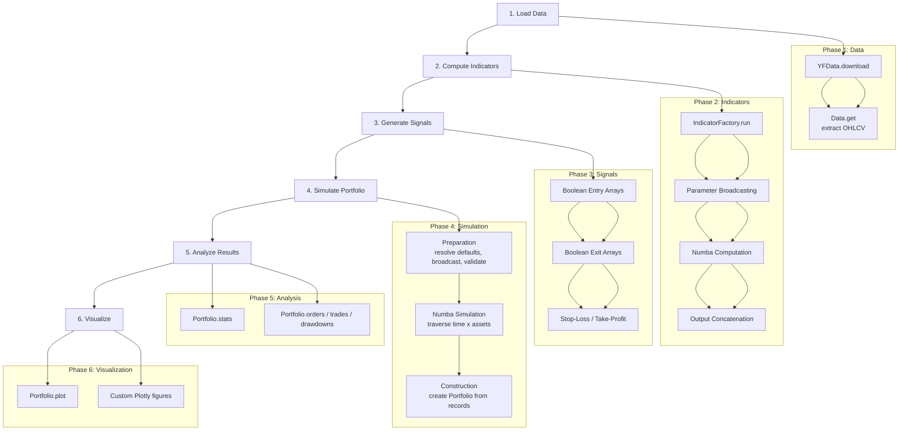
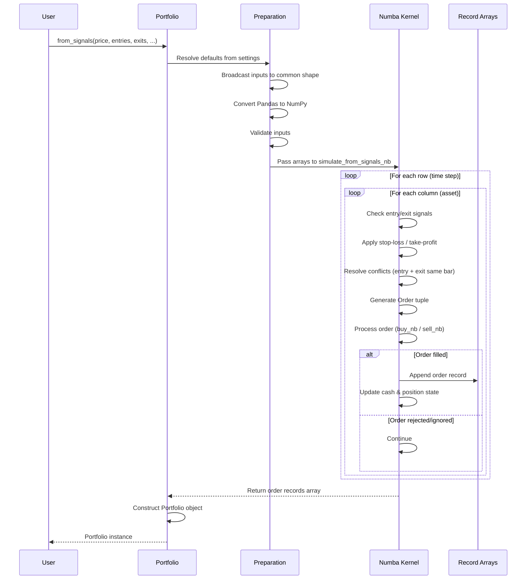
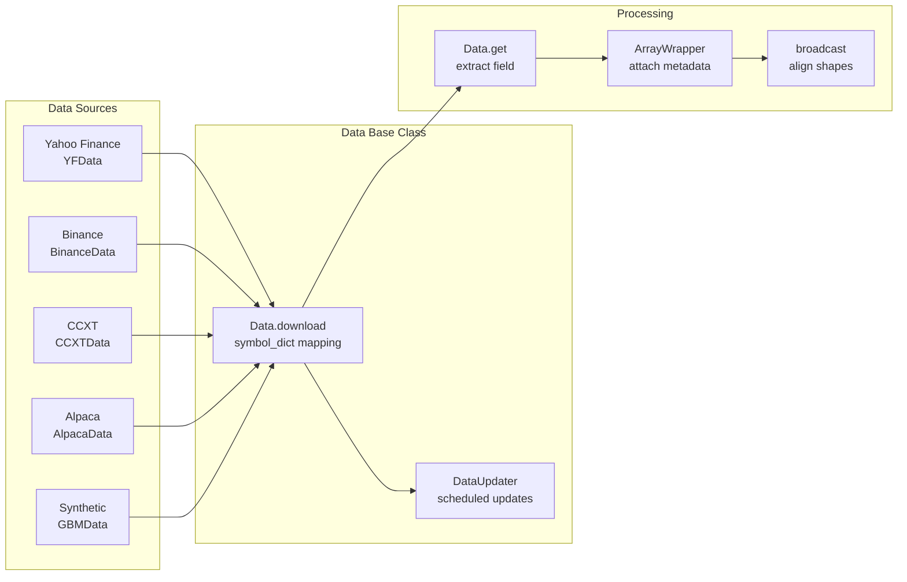
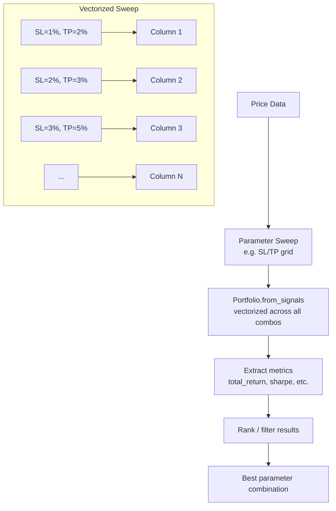
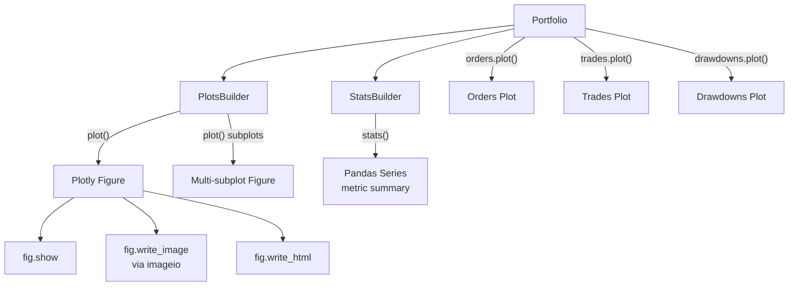

# vectorbt -- Workflow

## Backtesting Pipeline



## Signal Generation to Portfolio Simulation Flow



## Data Loading and Preprocessing



**Data flow:**

1. **Fetch**: `Data.download('SYMBOL', start, end)` calls the source API (yfinance, ccxt, etc.)
2. **Store**: Returns are stored per-symbol in a `symbol_dict` mapping
3. **Extract**: `Data.get('Close')` extracts a specific field as a DataFrame
4. **Update**: `DataUpdater` supports scheduled re-fetching via the `schedule` library

## Indicator Computation Pipeline

```mermaid
flowchart TD
    INPUT[Input Arrays<br/>e.g. close prices] --> PARAMS[Parameter Grid<br/>e.g. window=2,3,5,10,20]

    PARAMS --> BC[Broadcast<br/>inputs x params]
    BC --> COMPUTE[Compute per combo<br/>Numba @njit or NumPy]
    COMPUTE --> CONCAT[Concatenate outputs<br/>MultiIndex columns]
    CONCAT --> CACHE[Cache results]
    CACHE --> OUTPUT[IndicatorBase instance<br/>with .output, .run() etc.]

    subgraph "IndicatorFactory Pipeline"
        BC
        COMPUTE
        CONCAT
    end

    subgraph "Example: MA"
        MA_IN["close prices (2 assets)"]
        MA_P["window = [10, 20]"]
        MA_OUT["4-column output<br/>(2 assets x 2 windows)"]
        MA_IN --> MA_P --> MA_OUT
    end
```

**Key steps:**

1. `IndicatorFactory` creates a class with `run()` and `run_combs()` methods
2. `run()` broadcasts inputs against parameter arrays
3. For each parameter combination, the custom function is called
4. Results are concatenated with a MultiIndex encoding the parameter values
5. Crossover/signal methods are auto-generated

## Portfolio Optimization Flow

vectorbt supports parameter sweep optimization through broadcasting:



All parameter combinations run in a single simulation call. No Python-level loop required.

## Plotting and Visualization Flow



**Visualization features:**
- `Portfolio.plot()` -- equity curve with trade markers
- `Portfolio.drawdowns.plot()` -- drawdown periods
- `Portfolio.orders.plot()` -- order execution on price chart
- Custom subplots via `PlotsBuilder`
- Export to PNG, HTML, or interactive display

---
## See Also
- [README](README.md) — Project overview and quick start
- [Architecture](architecture.md) — System design and components
- [State Management](state-management.md) — State lifecycle and data models
- [Development](development.md) — Development guide and best practices
